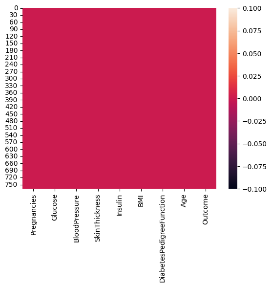
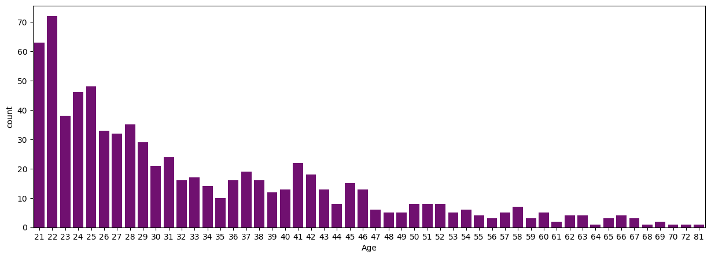

# Laporan Proyek Machine Learning
### Nama : Rina Juniar
### Nim : 211351126
### Kelas : Pagi B

## Domain Proyek

Dapat digunakan sebagai sebuah sistem aplikasi untuk memprediksi apakah seseorang terkena diabetes
## Business Understanding

seseorang jadi lebih mudah mengetahui dirinya  terkena diabetes atau tidak 

Bagian laporan ini mencakup:

### Problem Statements

- Tidak semua fasilitas kesehatan mempunyaki alat tes untuk mengecek diabetes

### Goals

- mencari solusi untuk memudahkan orang-orang mengetahui dirinya terkena diabetes atau tidak

    ### Solution statements
    - pengebangan platform sistem informasi tentang prediksi diabetes
    - Model yang dihasilkan dari datasets itu menggunakan metode Logistic Regression.

## Data Understanding
Dataset yang saya gunakan berasal jadi Kaggle yang berisi data prediksi diabetes.Dataset ini mengandung 769 baris dan lebih dari 9 columns.

kaggle datasets download -d uciml/pima-indians-diabetes-database  

### Variabel-variabel sebagai berikut:
- Pregnancies = Jumlah kehamilan
- Glucose = konsentrasi glukosa 2 jam dalam tes toleransi glukosa oral
- BloodPressure = Tekanan darah diastolik (mm Hg)
- SkinThickness = Ketebalan lipatan kulit (mm)
- Insulin = 2-Jam serum insulin (mu U / ml)
- BMI = Indeks massa tubuh (berat dalam kg / (tinggi dalam m) ^ 2)
- DiabetesPedigreeFunction = Riwayat keturunan diabetes
- Age = Umur (tahun)
- Variabel Outcome = Class (0 atau 1) 268 dari 768 adalah 1, yang lain adalah 0

## Data Preparation

DESKRIPSI LIBRARY
```python
import numpy as np
import pandas as pd
import seaborn as sns
import matplotlib.pyplot as plt
from sklearn.model_selection import train_test_split
from sklearn.linear_model import  LogisticRegression
from sklearn.metrics import accuracy_score

```
MEMANGGIL DATASET
```python
diabetes_data = pd.read_csv('diabetes.csv')
```
DESKRIPSI DATASET
```python
diabetes_data.head()
```
```python
df.info()
```
```python
sns.heatmap(df.isnull())
```

```pyyhon
Glucose = df.groupby('Age').count()[['BMI']].sort_values(by='BMI').reset_index()
Glucose = Glucose.rename(columns={'BMI' :'count'})
```
```python
plt.figure(figsize=(15,5))
sns.barplot(x=Glucose['Age'],y=Glucose['count'],color='purple')
```

```
PISAHKAN DATA ATRIBUT DENGAN LABEL

```python
X = diabetes_data.drop(columns = 'Outcome', axis=1)
Y = diabetes_data['Outcome']
```
```python
print(X)
```

```python
print(Y)
```
PISAHKAN DATA TRAINING DAN DATA TESTING
```python
X_train, X_test, Y_train, Y_test = train_test_split(X, Y, test_size=0.2, stratify=Y, random_state=2 )
```
```python
print(X.shape, X_train.shape, X_test.shape)
```
MEMBUAT MODEL TRAINING
```python
model = LogisticRegression()
```
```python
model.fit(X_train, Y_train)
```
EVALUASI MODEL 
```X_train_prediction = model.predict(X_train)
training_data_accuracy = accuracy_score(X_train_prediction, Y_train)
```
```pyhton
print('akurasi data training :', training_data_accuracy)
```
```python
X_test_prediction = model.predict(X_test)
test_data_accuracy =accuracy_score(X_test_prediction, Y_test)
```
```python
print('akurasi data testing :', test_data_accuracy)
```
```python
input_data = (6, 148, 72, 35, 0, 33.6, 0.267, 50)

input_data_as_numpy_array = np.asarray(input_data)

input_data_reshaped = input_data_as_numpy_array.reshape(1,-1)

prediction = model.predict(input_data_reshaped)
print(prediction)

if (prediction[0]==0):
  print('Pasien Tidak Terkena Penyakit Diabetes')
else:
  print('Pasien Terkena Penyakit Diabetes')
```
SIMPAN MODEL
```python
import pickle
```
```pyhthon
filename = 'diabetes.sav'
pickle.dump(model, open(filename, 'wb'))
```

## Evaluation

```python
X_train_prediction = model.predict(X_train)
training_data_accuracy = accuracy_score(X_train_prediction, Y_train)
```
```python
print('akurasi data training :', training_data_accuracy)
```
0.7850162866449512
```python
X_test_prediction = model.predict(X_test)
test_data_accuracy =accuracy_score(X_test_prediction, Y_test)
```
```python
print('akurasi data testing :', test_data_accuracy)
```
0.7532467532467533

akurasi adalah metrik evaluasi yang mengukur seberapa baik model membuat prediksi yang benar dari total prediksi yang dilakukan. dalam konteks klasifikasi, akurasi memberikan gambaran mengenai seberapa sering model memprediksi kelas yang benar, baik kelas itu positif maupun negatif.
## Deployment
https://my-apk-estimasi-diabetes.streamlit.app//
